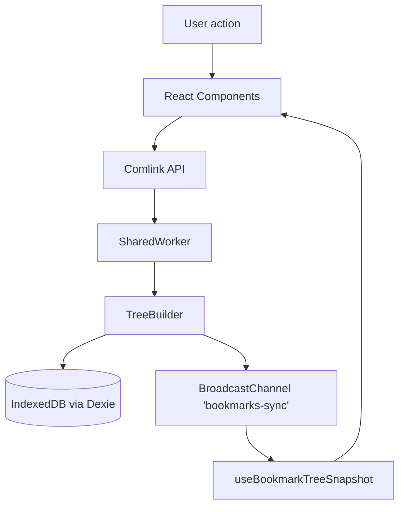
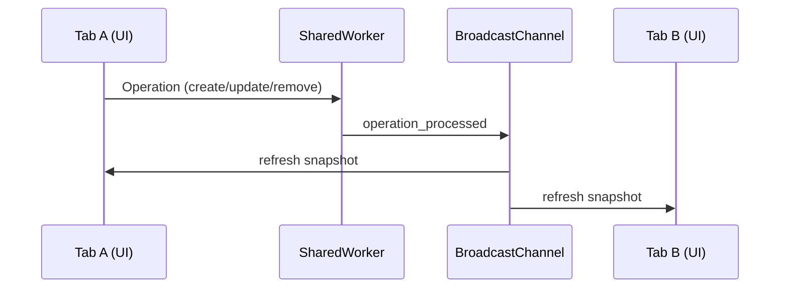
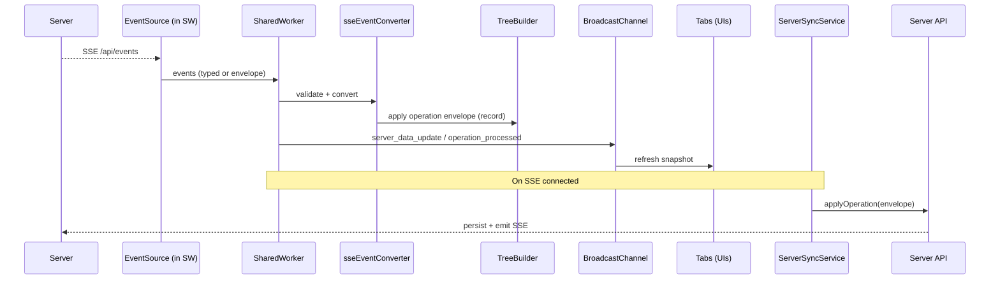

# Bookmarks

Full-stack TypeScript monorepo for a real-time bookmarks manager. The client is React + Vite; the server is Express with Drizzle ORM (SQLite) and Server‑Sent Events (SSE) for live updates.

## Contents

- Introduction
- Architecture
- Monorepo layout
- Quickstart
- Local development
- Environment
- Database (Drizzle + SQLite)
- Build and run (production)
- API overview
- Scripts
- Troubleshooting
- Contributing
- License

## Introduction

This app lets you explore a hierarchical bookmarks tree with live server updates over SSE. It uses a simple SQLite database via Drizzle ORM and a unified dev server that serves the React app through Vite middleware.

## Architecture

- Client: React 19 + Vite 7, TailwindCSS 4
- Server: Express (TypeScript), SSE endpoints
- Database: SQLite (single file at project root: `bookmarks.db`) managed with Drizzle ORM/migrations

Diagram: see `architecture.png` at the repo root.


This diagram shows the overall system architecture with the client-server separation, database layer, and real-time communication flow via Server-Sent Events.


## Monorepo layout

- `client/` – React + Vite SPA
- `server/` – Express API + SSE, Drizzle ORM, serves client in prod

## Quickstart

Prerequisites:
- Node.js 18+ (Node 20 recommended)
- npm (workspace-enabled)

Install dependencies (root installs both workspaces):

```sh
npm install
```

Start the dev server (serves API and client together):

```sh
npm run dev
# App available at http://localhost:5000
```

## Local development

The server integrates Vite in middleware mode, so a single process serves both:

- App URL: http://localhost:5000
- Health: GET http://localhost:5000/api/health
- Status: GET http://localhost:5000/api/status
- SSE stream: GET http://localhost:5000/api/events

Notes:
- Default port is `5000` (override with `PORT`).
- The server watches TypeScript sources via `tsx` and reloads automatically.

## Environment

Optional variables (server):

```
PORT=5000   # default 5000
```

Database file path is fixed to the repo root (`bookmarks.db`).

## Database (Drizzle + SQLite)

- SQLite file: `./bookmarks.db` (auto-created if missing)
- Drizzle config: `server/drizzle.config.ts`
- Migrations directory: `server/src/db/migrations`

Common tasks:

```sh
# Apply migrations to bookmarks.db
npm -w server run db:migrate

# Generate SQL migrations after editing schema (server/src/db/schema.ts)
npm -w server run db:generate

# Explore DB with Drizzle Studio
npm -w server run db:studio
```

Tip: If you want to reset local data, stop the app and remove `bookmarks.db` (this deletes all data).

## Build and run (production)

Build the client and server, then start the production server which serves static files from `client/dist`:

```sh
npm -w client run build
npm -w server run build
npm -w server start
# Prod server: http://localhost:5000
```

## Real-time integration (3 levels)

Level 1 — within a tab (instant UI):
- UI calls the SharedWorker via a typed Comlink API (see `useSharedWorkerConnection`).
- The worker applies operations to the in-memory tree and persists them.
- The worker broadcasts `operation_processed` and related events on `bookmarks-sync`; the tab listens and refreshes a snapshot via `useBookmarkTreeSnapshot` (debounced ~30ms).



Level 2 — across tabs (same device):
- A single SharedWorker coordinates all tabs in the browser profile.
- Cross-tab updates propagate via BroadcastChannel:
	- `bookmarks-sync` carries tree updates (operation_processed, hydration, reload).
	- `bookmarks-sse` carries SSE connection state and server event metadata.
- Only one SSE connection exists per device (owned by the worker), reducing load and duplication.



Level 3 — across devices (server):
- The worker’s `SSEManager` holds a single `EventSource` to `/api/events?namespace=…`.
- Server events are validated/converted (`sseEventConverter`) into operation envelopes, then applied and broadcast to tabs.
- `ServerSyncService` syncs local pending/failed operations to the server when SSE is connected (batched, retries, debounced status broadcasts), ensuring eventual consistency.



Key channels and components:
- `SharedWorkerConnection` + Comlink: strongly-typed worker API per tab.
- BroadcastChannel names: `bookmarks-sync` (tree) and `bookmarks-sse` (SSE state/events).
- `SSEManager`: connection lifecycle, reconnection backoff, event routing.
- `useBroadcastChannel` and `useBookmarkTreeSnapshot`: light UI subscribers.

## Architectural nuances

- Namespace-aware sync:
	- API routes include `:namespace` (e.g., `/api/:namespace/operations`).
	- DB schema stores a `namespace` column across entities; default namespace is `default`.

- SharedWorker as the single authority on the client:
	- Normalizes writes (create/update/move/toggle) and emits a consistent operation log.
	- Minimizes duplicate work by centralizing SSE and DB access per device.

- Local persistence and offline readiness:
	- IndexedDB (Dexie) stores the operation log and supports pending/failed/completed with retry counts.
	- The UI remains responsive with optimistic updates; sync reconciles once connected.

- Snapshot-driven UI:
	- Tabs render from a serialized snapshot pulled from the worker.
	- Broadcasts trigger debounced reloads, keeping React components simple and stable.

- Hydration strategy:
	- On SSE connect/reconnect, the worker hydrates the root (and on-demand folders) from the server.
	- Guards like `lastHydrationTime` prevent redundant work; server baseline timestamp helps dedupe.

- Resilience:
	- SSE reconnection with incremental delays; explicit `sse_state_changed` broadcasts for UX.
	- Sync batches, bounded retries, and explicit failure paths enable controlled backoff.

- Dev/prod parity:
	- Dev uses Vite middleware inside the Express process (single origin at `:5000`).
	- Prod serves `client/dist` from the same Express server; SSE path remains `/api/events`.

## Failure modes and recovery

| Scenario | Symptoms | Recovery strategy | Notes |
|---|---|---|---|
| SSE disconnect/timeout | Indicators show “disconnected”; no live updates | `SSEManager` auto-reconnect with backoff; UI updated via `sse_state_changed`; sync resumes on reconnect | Only one SSE per device via SharedWorker |
| Network offline | Requests fail; operations accumulate locally | Operations stay pending in IndexedDB; `ServerSyncService` retries when back online | UI stays responsive via optimistic updates |
| Server applyOperation fails | Operation stays pending/failed | Bounded retries; marked failed with error; retried on next connect; can be force-synced | See `ServerSyncService` retryCount handling |
| SharedWorker unsupported | Cross-tab sync absent; per-tab works only | No built-in fallback; app functions in a single tab; consider a Service Worker fallback if needed | Browser limitation |
| BroadcastChannel unsupported | Tabs don’t see each other’s updates | App still works within a single tab; updates apply when tab refreshes | Older browsers only |
| IndexedDB quota/blocked | Local persistence errors | Clear site storage or increase quota; app may run in-memory with limited durability | Dexie logs errors to console |
| DB migration error (server) | Server startup/migration fails | Run `npm -w server run db:migrate`; verify `bookmarks.db` path/permissions | `drizzle.config.ts` points to `../bookmarks.db` |
| Port 5000 in use | Dev server won’t start | Set `PORT` to a free port or stop conflicting process | See Troubleshooting |

## API overview

Base URL (dev/prod): `http://localhost:5000`

- `GET  /api/health` – liveness check
- `GET  /api/status` – server status and connection counts
- `GET  /api/events` – Server‑Sent Events stream
- `GET  /api/:namespace/tree/node/:nodeId` – fetch a subtree starting at `nodeId`
- `GET  /api/:namespace/operations?limit=…` – list recent operations
- `POST /api/:namespace/operations/apply` – apply an operation envelope (sync)
- `HEAD /api/ping` – connectivity check

## Scripts

Root:
- `npm run dev` – start server with Vite middleware (serves client + API)
- `npm start` – start compiled server (prod)

Client (`client/`):
- `npm run dev` – Vite dev server (used via server in dev)
- `npm run build` – type-check + client build
- `npm run preview` – preview built client

Server (`server/`):
- `npm run dev` – dev server with Vite middleware (from root, preferred)
- `npm run build` – compile TypeScript to `dist/`
- `npm start` – run `dist/prod.js` (serves `client/dist`)
- `npm run db:generate` – generate migrations
- `npm run db:migrate` – apply migrations
- `npm run db:studio` – open Drizzle Studio

## Troubleshooting

- Port already in use (EADDRINUSE): set a different `PORT` or stop the conflicting process.
- Missing UI in production: ensure `client` was built before `npm -w server start`.
- DB issues: verify `bookmarks.db` exists; re-run `npm -w server run db:migrate`; use `db:studio` to inspect.

## Contributing

- Use TypeScript and keep code small and readable.
- Run builds locally before pushing: client `build`, server `build`.
- Prefer small PRs and include a brief description.
