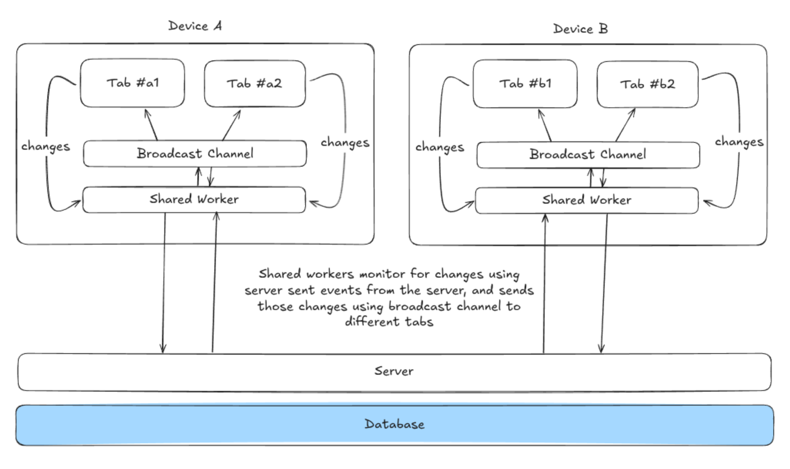

# Bookmarks

Full-stack TypeScript monorepo for a real-time bookmarks manager. The client is React + Vite; the server is Express with Drizzle ORM (SQLite) and Server‑Sent Events (SSE) for live updates.

## Contents

- Introduction
- Architecture
- Monorepo layout
- Quickstart
- Local development
- Environment
- Database (Drizzle + SQLite)
- Build and run (production)
- API overview
- Scripts
- Troubleshooting
- Contributing
- License

## Introduction

This app lets you explore a hierarchical bookmarks tree with live server updates over SSE. It uses a simple SQLite database via Drizzle ORM and a unified dev server that serves the React app through Vite middleware.

## Architecture

- Client: React 19 + Vite 7, TailwindCSS 4
- Server: Express (TypeScript), SSE endpoints
- Database: SQLite (single file at project root: `bookmarks.db`) managed with Drizzle ORM/migrations

Diagram: see `architecture.png` at the repo root.




This diagram shows the overall system architecture with the client-server separation, database layer, and real-time communication flow via Server-Sent Events.


## Monorepo layout

- `client/` – React + Vite SPA
- `server/` – Express API + SSE, Drizzle ORM, serves client in prod

## Quickstart

Prerequisites:
- Node.js 18+ (Node 20 recommended)
- npm (workspace-enabled)

Install dependencies (root installs both workspaces):

```sh
npm install
```

Start the dev server (serves API and client together):

```sh
npm run dev
# App available at http://localhost:5000
```

## Local development

The server integrates Vite in middleware mode, so a single process serves both:

- App URL: http://localhost:5000
- Health: GET http://localhost:5000/api/health
- Status: GET http://localhost:5000/api/status
- SSE stream: GET http://localhost:5000/api/events

Notes:
- Default port is `5000` (override with `PORT`).
- The server watches TypeScript sources via `tsx` and reloads automatically.

## Environment

Optional variables (server):

```
PORT=5000   # default 5000
```

Database file path is fixed to the repo root (`bookmarks.db`).

## Database (Drizzle + SQLite)

- SQLite file: `./bookmarks.db` (auto-created if missing)
- Drizzle config: `server/drizzle.config.ts`
- Migrations directory: `server/src/db/migrations`

Common tasks:

```sh
# Apply migrations to bookmarks.db
npm -w server run db:migrate

# Generate SQL migrations after editing schema (server/src/db/schema.ts)
npm -w server run db:generate

# Explore DB with Drizzle Studio
npm -w server run db:studio
```

Tip: If you want to reset local data, stop the app and remove `bookmarks.db` (this deletes all data).

## Build and run (production)

Build the client and server, then start the production server which serves static files from `client/dist`:

```sh
npm -w client run build
npm -w server run build
npm -w server start
# Prod server: http://localhost:5000
```

## API overview

Base URL (dev/prod): `http://localhost:5000`

- `GET  /api/health` – liveness check
- `GET  /api/status` – server status and connection counts
- `GET  /api/events` – Server‑Sent Events stream
- `GET  /api/:namespace/tree/node/:nodeId` – fetch a subtree starting at `nodeId`
- `GET  /api/:namespace/operations?limit=…` – list recent operations
- `POST /api/:namespace/operations/apply` – apply an operation envelope (sync)
- `HEAD /api/ping` – connectivity check

## Scripts

Root:
- `npm run dev` – start server with Vite middleware (serves client + API)
- `npm start` – start compiled server (prod)

Client (`client/`):
- `npm run dev` – Vite dev server (used via server in dev)
- `npm run build` – type-check + client build
- `npm run preview` – preview built client

Server (`server/`):
- `npm run dev` – dev server with Vite middleware (from root, preferred)
- `npm run build` – compile TypeScript to `dist/`
- `npm start` – run `dist/prod.js` (serves `client/dist`)
- `npm run db:generate` – generate migrations
- `npm run db:migrate` – apply migrations
- `npm run db:studio` – open Drizzle Studio

## Troubleshooting

- Port already in use (EADDRINUSE): set a different `PORT` or stop the conflicting process.
- Missing UI in production: ensure `client` was built before `npm -w server start`.
- DB issues: verify `bookmarks.db` exists; re-run `npm -w server run db:migrate`; use `db:studio` to inspect.

## Contributing

- Use TypeScript and keep code small and readable.
- Run builds locally before pushing: client `build`, server `build`.
- Prefer small PRs and include a brief description.
