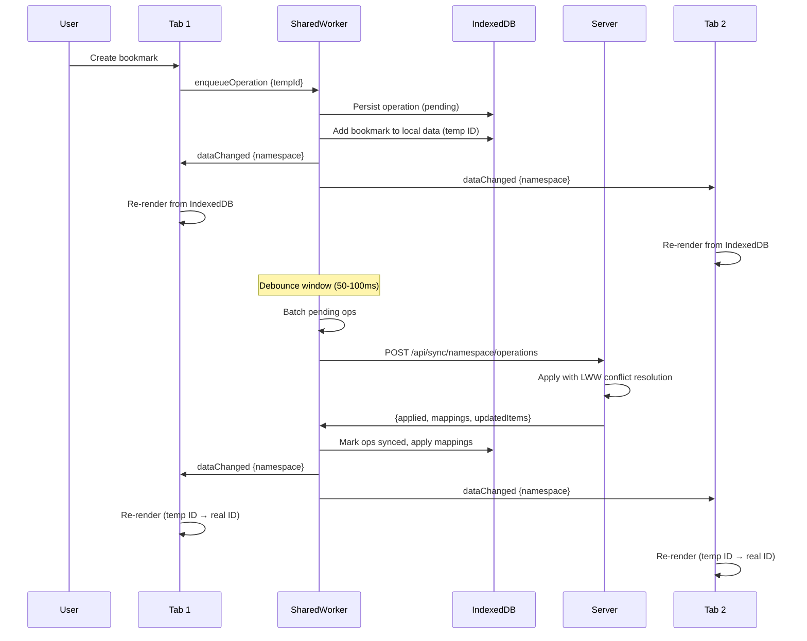
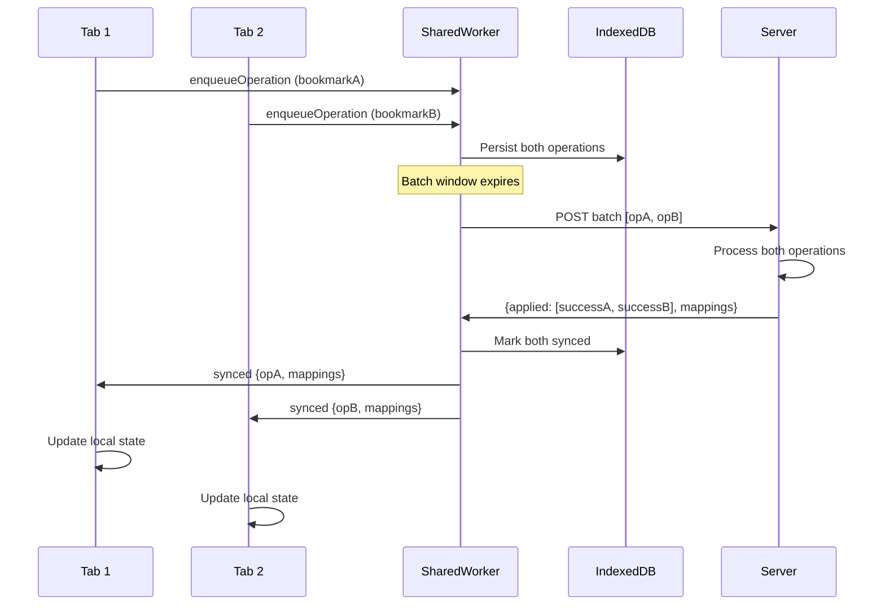
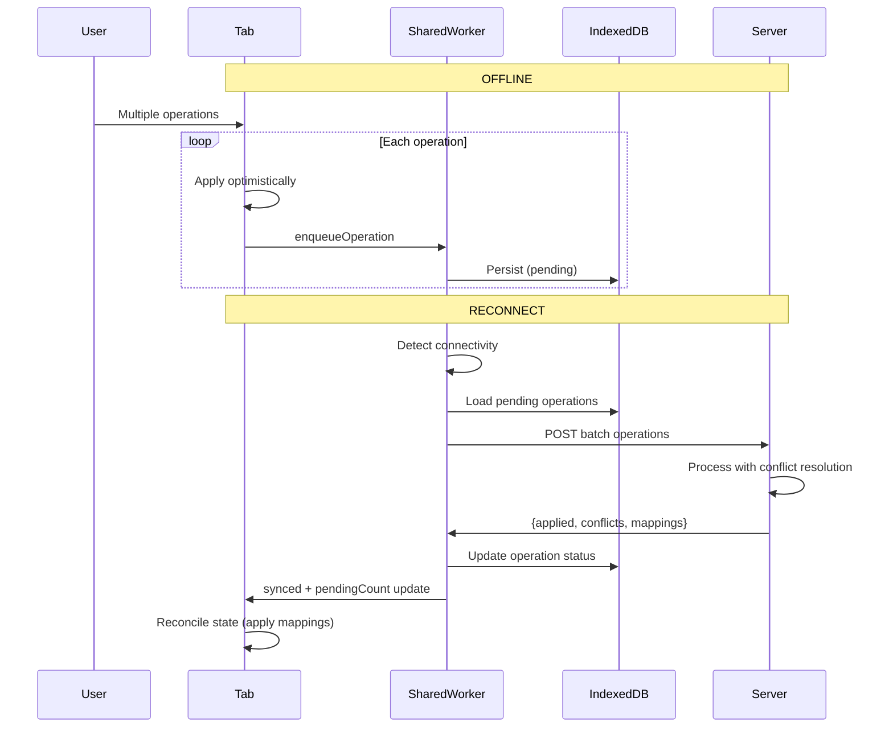
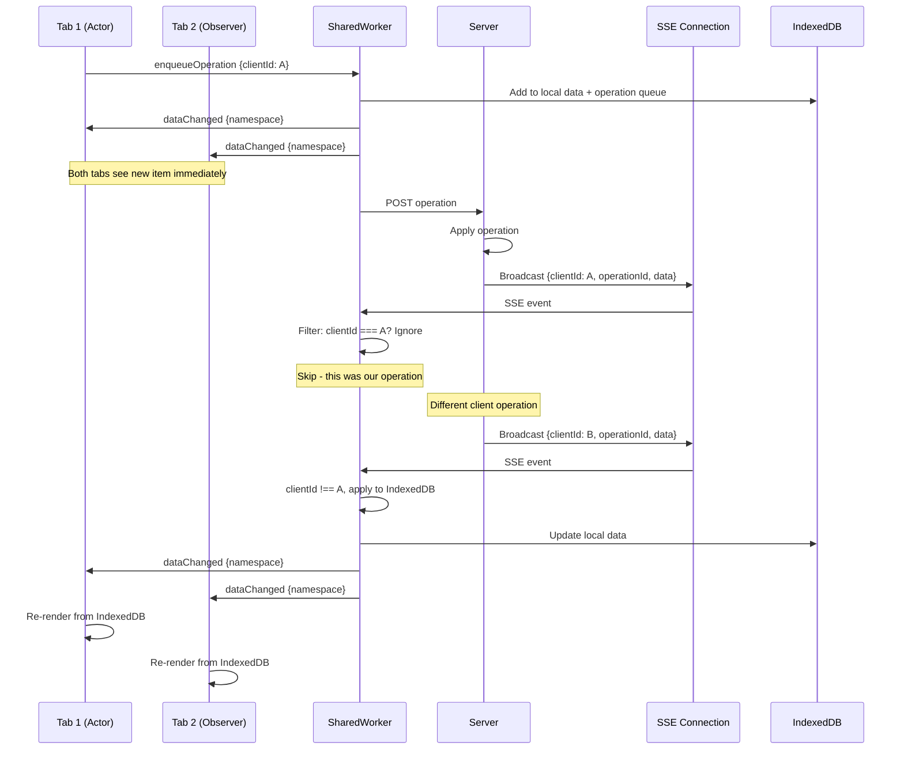
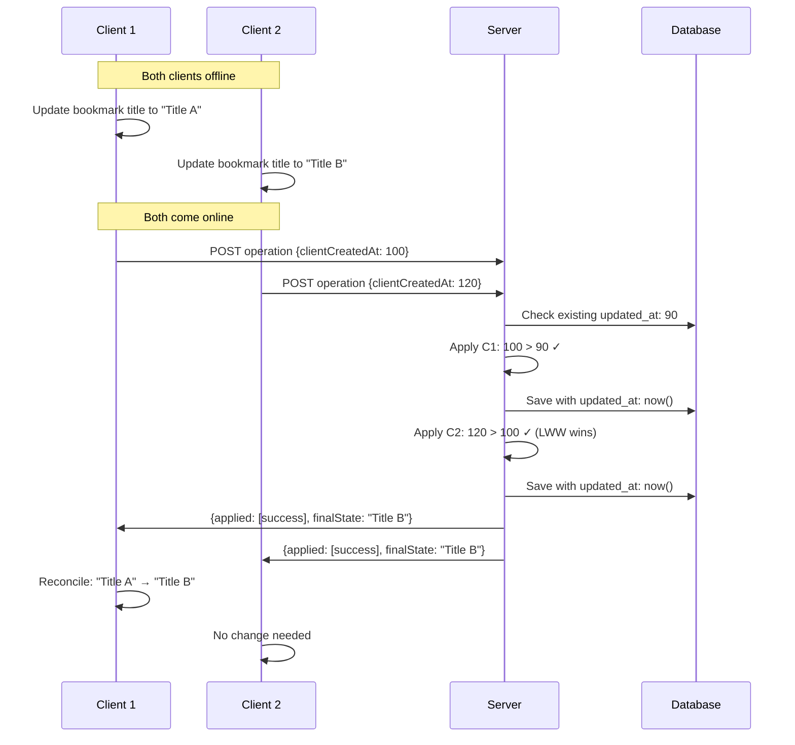
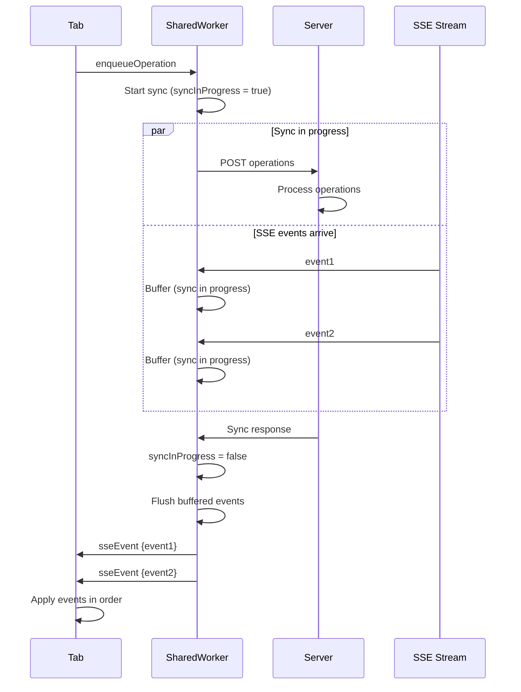
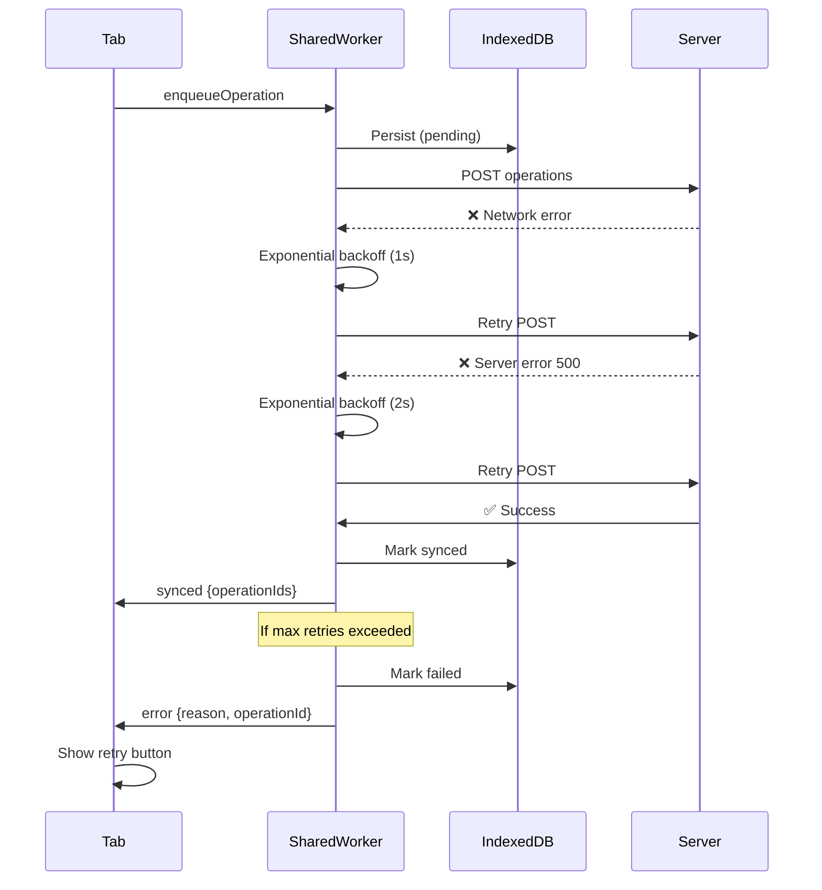

# Offline-First MVP Implementation Plan (Lightweight)

## Purpose
Deliver a minimal, reliable offline-first experience that works end-to-end with optimistic updates, local persistence, queued operations, and simple conflict handling. Defer complex algorithms (vector clocks, advanced conflict resolution, background sync) to later phases.

## MVP Goals
- Local-first reads: the UI always renders from local storage.
- Optimistic writes: reflect user changes immediately and queue ops.
- Simple sync: batch pending operations when online, idempotent on server.
- Simple conflict strategy: last-writer-wins (LWW) per item, deletes win over updates.
- No data loss: every operation is persisted locally before network calls.
- Backward compatible with existing SSE updates.

## Out of Scope (for MVP)
- Vector clocks, per-node clocks, OT/CRDTs.
- Manual conflict resolution UI.
- Background Sync service worker as a hard dependency.
- Complex structural conflict strategies for reordering.

---

## Architecture Overview (MVP)

- Client
  - IndexedDB via a battle-tested library (Dexie or idb) for local data and operation queue.
  - Local data layer is the source of truth for the UI.
  - SharedWorker as the cross-tab coordinator for queue + sync (single instance per origin): owns debouncing, reachability, posting batches, and multiplexing SSE to all tabs.
  - Reachability check for online status; navigator.onLine used only as a hint.
  - Batched sync with exponential backoff; idempotent operations (operationId).
  - SSE continues to stream updates; ignore self-originated events.

- Server
  - Minimal operation endpoint that processes batches idempotently.
  - Operation log table for auditing and deduplication (by operationId).
  - LWW conflict handling using updatedAt timestamps.
  - SSE publishing includes clientId and operationId for client filtering.

---

## Flow Diagrams

### 1. Write Operation Flow (Queue-First)



### 2. Multi-Tab Coordination



### 3. Offline to Online Transition



### 4. SSE Event Distribution



### 5. Conflict Resolution Flow



### 6. Sync During SSE Buffer



### 7. Error Handling and Retry



---

## SharedWorker Coordinator (MVP)

Use a SharedWorker to coordinate across multiple tabs/sessions. Extend `client/public/sse-shared-worker.js` to also manage the operation queue and sync.

Responsibilities
- Enqueue: receive operations from tabs, persist atomically to IndexedDB (Dexie/idb) per namespace.
- Debounce/batch: per-namespace batching window (50–100ms) before sending.
- Reachability: periodic ping to `/api/ping` (or `/api/healthz`) and exponential backoff.
- Sync: POST one batch per namespace to `/api/sync/:namespace/operations`, dedupe by `operation.id`, apply tempId→realId mappings, mark ops synced/failed.
- SSE: maintain a single SSE connection; ignore self-originated events; broadcast events to all connected tabs. Buffer during active sync.
- Recovery: on worker start, resume syncing pending operations.

Messaging contract
- From tab → worker
  - `enqueueOperation` { namespace, operation }
  - `syncNow` { namespace? }
  - `subscribe` { namespace }
  - `getStatus` { namespace? }
- From worker → tabs
  - `dataChanged` { namespace }
  - `pendingCount` { namespace, count }
  - `syncStatus` { namespace, status: 'syncing' | 'synced' | 'error', error? }
  - `error` { reason, operationId? }

Fallbacks
- If SharedWorker unsupported, fall back to BroadcastChannel with leader election (one tab acts as coordinator). Keep the same message shapes.

---

## Client Implementation

### 1) Types and IDs

Create `client/src/types/operations.ts`:
- Operation
  - id: string (UUID)
  - clientId: string
  - namespace: string
  - type: 'CREATE_BOOKMARK' | 'UPDATE_BOOKMARK' | 'DELETE_ITEM' | 'CREATE_FOLDER' | 'UPDATE_FOLDER' | 'MOVE_ITEM'
  - payload: any (typed per operation)
  - clientCreatedAt: number (ms)
  - status: 'pending' | 'synced' | 'failed'
- Use temporary IDs for created entities (e.g., `temp_abc123`) and map to server IDs on success.

### 2) Local DB and Operation Queue

New files:
- `client/src/services/localDB.ts` (Dexie/idb schema)
  - tables: `bookmarks`, `folders`, `operations`, `meta`
  - indexes: by `id`, `namespace`, `status`
- `client/src/services/operationQueue.ts`
  - Worker-owned helpers for: enqueue(op), getPending(namespace), markSynced(operationIds), markFailed(operationIds)
  - Optional batching window: use `ReturnType<typeof setTimeout>` (avoid NodeJS.Timeout in browser)
- `client/src/services/localDataService.ts`
  - getBookmarks(namespace)
  - applyOperationOptimistically(operation)
  - reconcileWithServerState(serverItems)

Prefer Dexie or idb for reliability, versioned migrations, and transactions.

### 3) Online/Reachability

- Managed by the SharedWorker: navigator.onLine as a hint, plus periodic ping to confirm reachability.
- Exponential backoff for retries: 1s, 2s, 5s, 10s, 30s.

### 4) BookmarkAPI changes (`client/src/services/bookmarkAPI.ts`)

- Main thread posts operations to SharedWorker; no optimistic updates on main thread.
- SharedWorker applies operations to IndexedDB and broadcasts `dataChanged` to all tabs.
- Tabs re-render from IndexedDB as the single source of truth.
- On sync completion, worker applies tempId→realId mappings and broadcasts `dataChanged` again.

Pseudocode outline (main thread):

```ts
async function createBookmark(namespace, request) {
  const tempId = `temp_${uuid()}`;
  const op: Operation = {
    id: uuid(),
    clientId: getClientId(),
    namespace,
    type: 'CREATE_BOOKMARK',
    payload: { ...request, id: tempId },
    clientCreatedAt: Date.now(),
    status: 'pending',
  };

  // No optimistic update - let worker handle everything
  sharedWorkerPort.postMessage({ type: 'enqueueOperation', namespace, operation: op });
  
  // UI will update when worker broadcasts dataChanged
  return { id: tempId }; // Return temp ID for immediate reference
}
```

Note: For timers in browser code, use `ReturnType<typeof setTimeout>`.

### 5) Sync process (in SharedWorker)

- Triggered after enqueues (debounced), on reconnect, on app start, or by `syncNow`.
- Steps:
  - Read all `pending` operations ordered by `clientCreatedAt`.
  - POST to `/api/sync/:namespace/operations` with `{ clientId, operations }`.
  - Handle response `{ applied: [...], updatedItems, mappings }`.
  - Persist results: mark ops, apply mappings (temp→real) across local DB and remaining queued ops.
  - Broadcast `dataChanged` to trigger tab re-renders.

### 6) SSE Integration

- Maintain a single SSE connection in the SharedWorker.
- Include `clientId` and `operationId` in server events; worker filters out own ops.
- On external SSE events, apply changes to IndexedDB and broadcast `dataChanged` to tabs.
- If `syncInProgress`, worker buffers events and flushes after sync completes.

### 7) UI Data Flow

- Tabs always read from IndexedDB via `localDataService.getBookmarks(namespace)`.
- Listen for `dataChanged` events from worker to trigger re-renders.
- `OfflineIndicator` component shows:
  - online state (from worker status)
  - pending operation count per namespace
  - sync progress/errors

---

## Server Implementation

### 1) Endpoints (MVP)

- POST `/api/sync/:namespace/operations`
  - body: `{ clientId: string, operations: Operation[] }`
  - behavior:
    - Deduplicate by `operation.id` (unique index)
    - Apply sequentially; LWW conflict resolution using server `updated_at`
    - Map temp IDs to real IDs on create; include mapping in response
    - Publish SSE events with `clientId`, `operationId`
  - response:
    - `{ applied: Array<{ operationId, status: 'success' | 'rejected', reason? , mappedIds? }>, updatedItems: Item[], serverTime: number }`

No session/init/complete endpoints needed for MVP.

### 2) Minimal operation log

Add table (SQLite/your DB):
- `operation_log`:
  - `id` (TEXT PRIMARY KEY) — operationId
  - `client_id` TEXT
  - `namespace` TEXT
  - `operation_type` TEXT
  - `payload` TEXT (JSON)
  - `status` TEXT CHECK(status IN ('applied','rejected'))
  - `server_timestamp` INTEGER

Add an index on (`namespace`, `server_timestamp`). Consider TTL/compaction later.

### 3) Conflict handling (MVP)

- LWW at item level:
  - Compare incoming `clientCreatedAt` to last known `updated_at`. If server newer, keep server; else apply client.
  - Deletes win over updates if delete is later.
- Reordering/move:
  - Keep last applied change by timestamp. If your current model uses a linked list, accept the latest move and rely on invariants within `BookmarkService` to prevent cycles.
  - Note: A future enhancement may introduce `orderKey` (fractional indexing) or a CRDT to improve concurrent ordering.

### 4) BookmarkService updates

- Add `applyOperation(op)` to route operations to existing CRUD/move functions.
- Ensure idempotency by checking `operation_log` before applying.
- Publish SSE with `{ type, data, clientId, operationId }`.

### 5) Migrations

- Update `server/src/db/schema.ts` to include `operation_log` and required indices with a clear version.
- Avoid `.js` import extensions in TS code samples; use extensionless imports (tsconfig will resolve).

---

## Data Model Notes

- Items (`bookmarks`, `folders`) should have `updated_at` (server-set) and `updated_by`.
- For created items with temp IDs, return mapping: `{ tempId: realId }` per operation. Client applies mapping across local DB and queued operations referencing the tempId.

---

## Error Handling and Retries

- Exponential backoff for sync; cap retries and surface a retry button.
- Mark operations as `failed` after N attempts; keep them visible for manual retry.
- Provide a “Reset local data from server” escape hatch to recover from corruption.

---

## Testing Strategy (MVP)

- Unit
  - Operation Queue (worker): enqueue, batch, persistence, idempotency
  - Local Data Service (tab): optimistic apply, reconcile, temp ID mapping
- Integration
  - Multi-tab enqueue + single sync coordinator (SharedWorker)
  - Offline → online flows with retries
  - Duplicate operation submission (idempotency)
  - Delete vs update race
- E2E
  - Long offline session then reconnect across two tabs; verify consistency
  - Two clients perform conflicting updates; verify LWW behavior

---

## Rollout Plan (3 Weeks)

- Week 1
  - Add Dexie/idb-powered `localDB` and worker-owned `operationQueue`
  - Implement SharedWorker skeleton extending `public/sse-shared-worker.js` (ports, message routing, reachability)
  - Add `operations.ts` types and temp ID strategy
  - Modify `bookmarkAPI` to optimistic-apply and post operations to the worker

- Week 2
  - Implement worker sync pipeline (debounce, batch, POST, mappings, mark synced/failed)
  - Add `/api/sync/:namespace/operations` endpoint with idempotent apply + `operation_log`
  - Wire server SSE events with `clientId` and `operationId`; worker multiplexes to tabs

- Week 3
  - Client reconciliation and temp ID mapping end-to-end
  - UI: OfflineIndicator, pending count, error toasts (fed by worker status)
  - Tests (unit + integration) and docs; add BroadcastChannel leader election fallback

---

## Follow-ups (Post-MVP)

- Vector clocks and richer conflict resolution only if LWW proves insufficient
- Operation coalescing and server-side log compaction/TTL
- Background Sync (feature-detected) with Workbox; Safari fallback manual
- Positional `orderKey` for robust concurrent reordering
- Conflict Resolution UI for rare manual cases

---

## Corrections from Original Draft

- Use `ReturnType<typeof setTimeout>` for timers in browser code.
- Fix typos: `initiateSync` (not `initiatSync`), `scheduleSync` (not `schedulSync`).
- Ensure TS imports are extensionless (avoid `.js` when compiling TS).
- Inject and pass all dependencies explicitly (e.g., ensure `SyncService` has access to `BookmarkService`).
